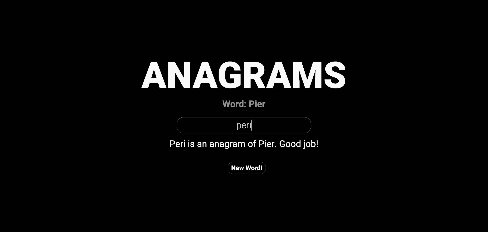

# Anagram Game

Simple and engaging web-based game where users test their word skills by determining whether their input is a valid anagram of a randomly provided word.



## Features
- **Random Word Selection**: A new word is randomly chosen from a predefined list each time the game starts or when a new word is requested.
- **Anagram Validation**: The game checks if the user's input is a valid anagram of the displayed word.
- **User Interaction**: Provides instant feedback on the validity of the anagram and offers the option to try a new word.

## How It's Made:

**Tech used:** HTML, CSS, JavaScript

Using HTML to structure the game interface, CSS to style it with a clean and modern design, and JavaScript to handle the game logic. The layout is designed with responsive design principles, ensuring it looks good on different screen sizes. JavaScript manages the game mechanics, such as fetching random words, validating anagrams, and updating the DOM with results.

## How to Use:

## How to Use:

1. Clone the repository:
```
git clone https://github.com/contactkc/anagrams.git
```
2. Navigate to the project directory:
```
cd anagrams
```
3. Open `index.html` in your preferred web browser:
```
open index.html
```

## License
This project is [MIT licensed](LICENSE).
